# Curso Docker

## 1 Introducción

## 1.1 - Introducción a Docker

Indice

- Contenedores
- Imagenes
- Docker Compose
- Desarrollo de aplicaciones

Una tecnología persiste en el tiempo dependiendo de quienes la usan

## 1.2 - Conceptos

- Docker es una cajita magica para correr mis aplicaciones, en cualquier lugar, sin complicaciones y eliminando el casico: "En mi computadora si funciona"
- El termino de contenedores no es algo nuevo dentro del entorno de Linux
- Docker se puede correr en diferentes SO, en la nube, e incluso dentro de una MV

  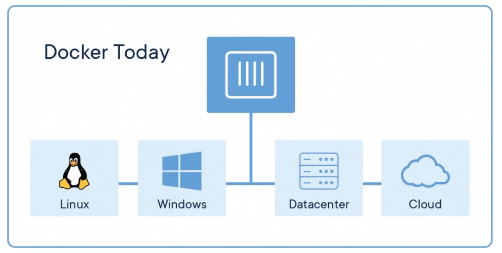

### Contenedor

Los contenedores son una abstracción en la capa de la aplicación que empaqueta el código y las dependencias juntos.

Esto significa que docker se ubica sobre la capa de infraestructura y posteriormente sobre el SO para poder correr nuestras aplicaciones haciendo uso de nuestra infraestructura y SO

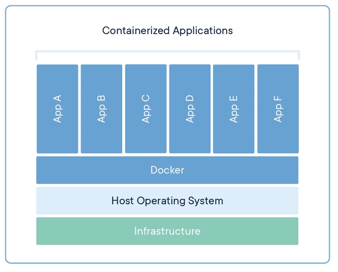

### MV

Las MV son una abstracción de hardware fisico que convierte un servidor en muchos servidores

Las MV ta,bién están sobre la infraestructura y el SO de nuestra máquina, sin embargo, estas traen su porpio SO, susprocesos, librerías y kernel, esto las hace más pesadas en tamaño (GB)

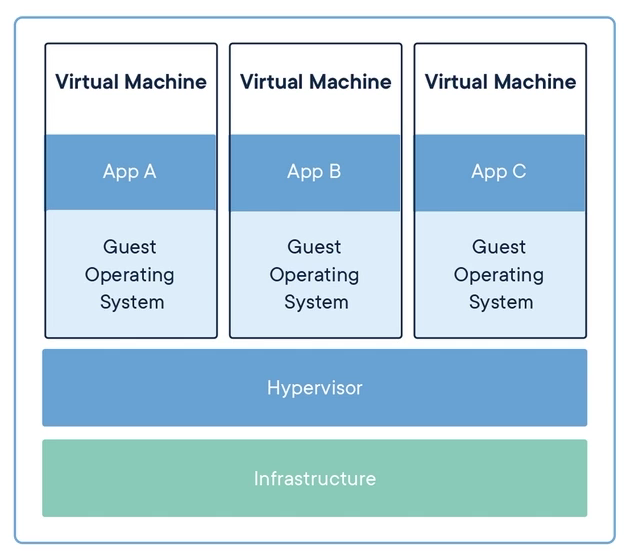

### Diferencias

Docker es mucho más ligero, rápido y portable a comparación de un MV

## 1.3 - Instalación

Como alternativas existen:

- Docker desktop - Windows y MAC
  - Interfaz gráfica que nos permite ejecutar docker y administrar los containers
- Docker Engine para linux
- Play with docker
  - Plataforma web para correr docker a través de una interfaz web

### Conceptos

- Docker ce - Docker Community Edition
  - Contiene todas las herramientas básicas para iniciar
  - Existe una versión Enterprise
- Docker CLI - Interfaz de comando
  - Nos permite interactuar con el docker engine

## 1.4 - Arquitectura

### Docker Engine

Es el motor de Docker
Está conformado por 3 partes:

- Server (docker daemon)
  - Es nuestro proceso principal que nos ayuda a correr todos los contenedores en nuestro sistema
- REST API
  - Nos permite comunicarnos con el Server a través de ciertos comandos
- Client (docker CLI)
  - Desde aqui nos comunicamos al REST API a través de comandos que el REST API comunicará al Server

De esta manera nos podemos comunicar con Docker y manejar los containers, images, networks y data volumes

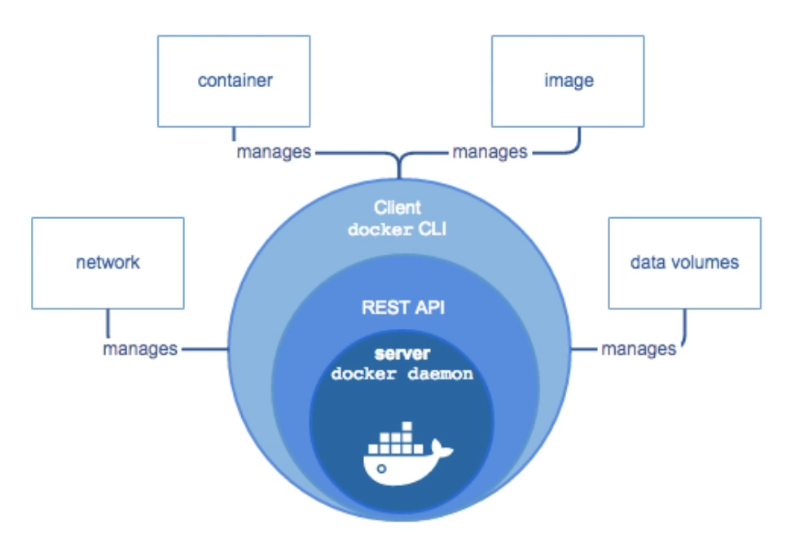

## Arquitectura de docker

Está dividida en 3 secciones

- Client
  - Es el conjunto de comandos donde se especifican ciertas instrucciones para comunicarnos con Docker
  - Al escribir nuestras instrucciones/comandos nos comunicamos con el REST API que se comunica con el demonio de docker
- Docker Host
  - Es una especificación al demonio de docker y a lo que puede hacer en las imagenes y/o contenedores como:
    - Construir imagenes
    - Levantar contenedores
    - etc.
- Registry
  - Repositorio de imagenes disponibles
  - En caso de usar una imagen que no tengamos docker acudirá al Registry para poder utilizarla

Resumiendo el flujo, desde el Docker CLI enviamos comandos que la REST API manda al demonio de docker, el cual administra las imagenes y contenedores dependiendo de las especificaciones que enviemos, este puede acudir al Registry en caso de que no tengamos dicha imagen descargada

### Imagenes

Archivos ISO que nos funcionan para instalarlas en nuestros containers
Las imagenes puede ser:

- Python
- PHP
- Ruby
- etc.

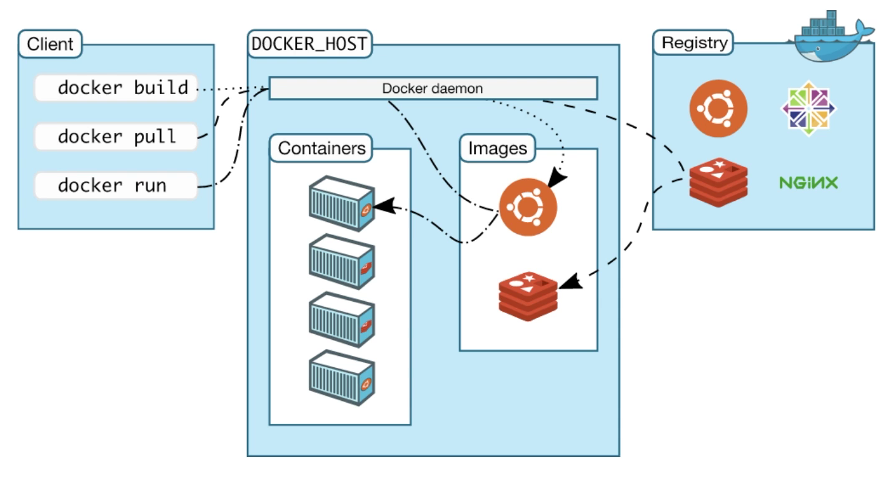

## 1.5 - Hola mundo

Comando para obtener imagenes desde Docker hub

```
sudo docker pull nginx
```

Especificando una versión de la imagen con :

```
sudo docker pull nginx:1.17-alpine
```

Comando para crear un container e inicializarlo (también descarga la imagen en caso de no tenerla localmente). También se exponen los puertos.

```
sudo docker run -p80:80 nginx:1.17-alpine
```

Docker se instala a nivel super su, por tanto, necesitamos hacer uso del comando sudo antes de cualquier comando de docker. Por tanto utilizaremos el siguiente comando para agregar un usuario al [grupo Docker](https://docs.docker.com/engine/install/linux-postinstall/), esto evita el uso repetitivo de sudo

```
sudo usermod -aG docker $USER
```

## 2. Contenedores

## 2.1 - Conceptos

### ¿Qué es un contenedor?

En el mundo real, un contenedor es una caja de metal y fueron creadas para transportar muchas cosas en su interior sin que les afecte el mundo exterior, para que sean transportadas de manera sencilla y más ordenada. Este concepto es la idea con la que se creo Docker.

### Un poco de historia

- 1979 - chroot: El concepto de contenedores se inició en 1979 con chroot de UNIX.
- 2008 - LXC: son las siglas de LinuX Containers y es la primera implementación más completa del administrador de contenedores de Linux.
- 2013 - Docker: Se desarrolló como un proyecto interno en una empresa de plataforma como servicio llamada dotCloud y luego se renombró como Docker.

### Contenedores en Docker

En el ámbito del software, un contenedor es una unidad estándar de software que empaqueta el código y todas sus dependencias para que la aplicación se ejecute de forma rápida y confiable de un entorno informático a otro.

## 2.2 - Imágenes

Para trabajar con imágenes, se debe saber cuales son las imágenes en la computadora local, se puede saber eso usando el siguiente comando, consiguiendo una lista de las imágenes en el disco local.

```
docker images
```

Tras ejecutar la el comando y verificas las imagenes podremos ver un header el cual contiene:

- REPOSITORY, el cual hace referencia al nombre de la Imagen que nosotros descargamos
- En TAG veremos la versión de la imagen
- IMAGE ID, contiene el identificador de la imagen en base 64
- CREATED, fecha de cuando fue creada la imagen, es importante saber que esta fecha no es la misma a la fecha de descarga de imagen
- SIZE, cuánto espacio en disco duro ocupa

### docker pull

Comando usado para descargar imágenes directo de un registry. En el curso para dar un ejemplo, se descarga una imagen de python versión 3 usando el comando de abajo:

```
docker pull python
```

Especificando una versión de la imagen con :

```
docker pull python:3
```

### docker run

Comando para levantar-correr contenedores basándose en las imágenes que hayan sido indicadas, acá en el curso se corre una imagen de nginx y una imagen de postgres, en el ultimo caso, se muestra como algunas imágenes tienen requerimientos y/o necesidades al momento de correr

```
sudo docker run python:3
```

### [DockerHub](https://hub.docker.com/)

Pagina donde están guardadas todas las imágenes que se pueden descargar en el registry de Docker.

## 2.3 - Logs, puertos y procesos

### Manejo de procesos

Al correr un contenedor con el comando docker run, se crea un contenedor basado en la imagen, sin embargo, si se quiere usar la terminal no se va a poder por que se esta ejecutando el proceso del contenedor, si se desea ejecutar otro comando se tendría que detener el proceso. La manera de correr un contenedor en segundo plano es agregando la bandera `-d`

```
docker run -d nginx
```

Ingresando el comando de arriba, la terminal suelta un identificador para el contenedor.

### docker ps

Es necesario saber visualizar los contenedores en segundo plano, se ejecuta el comando docker ps, al ejecutarlo muestra todo los contenedores que se están corriendo actualmente en la maquina local.

```
docker ps
```

La salida de este comando es información sobre los contenedores, toda información esta dividida en las siguientes columnas:

- CONTAINER ID: En esta columna van todo los identificadores de los contenedores que se están corriendo.
- IMAGE: El nombre de la imagen.
- COMMAND: Indica el comando que se utiliza al levantar el contenedor, este comando puede variar dependiendo de la imagen de Docker que se este utilizando.
- CREATED: Cuando fue creado el contenedor.
- STATUS: El estado en donde se encuentra el contenedor.
- PORTS: Los puertos que están utilizando los contenedores, en esto se profundiza más abajo.
- NAMES: Es el nombre que se genera automáticamente o aleatoriamente para el contenedor. Un contenedor se puede identificar por su CONTAINER - ID o por su nombre. Si se quiere un nombre más descriptivo y/o acorde a lo que se esta haciendo, se puede realizar lo siguiente

### NAMES

Para cambiar el nombre de un contenedor, existe la bandera --name, se escribe el comando y luego el nombre que se le va a dar

```
docker run -d --name mi-nginx nginx
```

### Procesos para contenedores

docker logs: Así obtenemos la información de lo que se esta ejecutando en el contenedor

```
docker logs mi-nginx
```

docker top: El comando para saber que sigue funcionando nuestro contenedor o que proceso se esta ejecutando de manera interna en el.

```
docker top mi-nginx
```

docker exec: Un comando que ejecuta comandos adentro del contenedor. Al momento de ejecutar comando, no todo los contenedores están construido de la misma manera, la mayoría esta construido utilizando imágenes basadas en distribuciones Linux, por ende, los comando de Linux son los más comunes, pero no todos tienen los mismos comando, en este caso se usa un comando muy común para Linux, ls, para alistar directorios.

```
docker exec mi-nginx ls
docker exec mi-nginx mkdir hola-mundo
```

Este comando ejecutará el comando `ls` dentro del container que contiene nginx, pudiendo acceder a nuestro sistema de archivos

La bandera `-it`(interactive) nos permite ejecutar los comandos como si estuvieramos dentro del container, acccediendo a mas funciones

```
docker exec -it mi-nginx ls
```

El despliegue de más información o funciones depende del comando, el siguiente comando nos permite ingresar a una terminal dentro de nuestro container

```
docker exec -it mi-nginx bash
```

### Detener y Eliminar Contenedores

Entonces, si se quiere detener alguno de los contenedores que se están ejecutando, se utiliza el siguiente `docker stop`, se escribe el comando y el nombre o identificador del contenedor.

```
docker stop mi-nginx
docker stop 414dcdc8b031
```

Importante saber que `docker stop` solo detiene el funcionamiento de los contenedores, no los elimina, entonces, el contenedor sigue en la computadora local, para saber cuales contenedores son todos los contenedores, sin importar que estén en funcionamiento o detenidos, se agrega la bandera `-a`

```
docker ps -a
```

Para eliminar contenedores, se usa el comando `rm`, que significa remove, permite eliminar contenedores que no se estén utilizando

```
docker rm mi-nginx
```

Existe una manera de saltarse el proceso de detener el contenedor y después eliminarlo, la bandera `--rm`, esto para eliminar el contenedor cuando este falle o se detenga

```
docker run -d --rm --name mi-nginx nginx
```

### Puertos

Para mapear los puertos usaremos la bandera `-p#:#`
Donde el primer puerto es el puerto fisico de nuestra maquina y el segundo es el puerto del container

> Los puertos que se deben usar son los mayores a 1024, estos puertos están reservados para operaciones del sistema

```
docker run -d --rm -p1024:1024 --name mi-nginx nginx
```

## 2.4 - Volúmenes

Los volúmenes son el mecanismo preferido para conservar los datos generados y utilizados por los contenedores en Docker, ¿Cuáles son las opciones para la data e información generada en Docker?, son 3:

De manera predeterminada, si el container "muere" entonces todos los datos del container se perderán, **(Volúmenes de memoria)**

Para guardar los datos independientemente de si el contenedor se elimina o no, nosotros podemos crear una ruta dentro de nuestro sistema de archivos para conservar la data, **Volúmenes basados en una ruta**

Para lograr esto usaremos la bandera `-v` (volume) el cual recibe dos parametros, primero especificaremos una ruta de nuestra computadora local y posteriormente especificaremos una ruta en el container

```
docker run -d --rm -p8000:80 -v C:/Users/elliot.gandarilla/Documents/docker-curso:/usr/share/nginx/html --name mi-nginx nginx
```

Con esto podemos generar la data en nueustra maquina local y de esta manera podemos conservar los datos en el container

El tercer método consiste en crear un Volúmen directamente en Docker

Podemos listar los volúmenes con el comando

```
docker volume ls
```

Comando para crear un volúmen

```
docker volume create web
```

Para montar un volúmen haremos uso de la bandera `--mount` el cual recibe dos parametros, primero especificamos un _source_ que es el volumen a montar (previamente creado) y posteriormente el _target_, que es la ruta a donde deseamos montar el volúmen

```
docker run -d --rm -p8000:80 --mount source=web,target=/usr/share/nginx/html --name mi-nginx nginx
```

Todos los cambios realizados serán guardados en el volúmen, con esto nos aseguramos de que los datos persisten en Docker aunque se eliminen los containers

### Eliminar un volúmen

> En la lista de los volúmenes, se puede ir almacenando todo los volúmenes que se quiera, esto es muy útil, más cuando se usa bases de datos, recordar que gastan espacio y se pueden eliminar usando rm (remove).

```
docker volume rm web
```

## 2.5 - Redes

El subsistema de red de Docker se puede conectar mediante controladores. Existen varios controladores de forma predeterminada y proporcionan la funcionalidad de red principal:

- Bridge (Default): Las redes por defecto que tiene docker y los contenedores
- Host: Crean los contenedores y no les asigna una IP, sin embargo, esos contenedores tienen comunicación con el host de Docker, solo se pueden comunicar a través del Demonio de Docker
- Overlay: Permite comunicar 2 computadores-servidores con Docker, se utiliza bastante cuando se crean servicios usando contenedores de Docker.
- Macvlan: Cuando se quiere crear un contenedor y se le quiere asignar una dirección MAC o una dirección física de red
- None: Siempre que no se necesite una red o algo relacionado con redes, puedes utilizar esta opción.

### Ejemplos

Para ver las redes en la computadora local, al instalar docker se tiene por defecto 3 redes: Bridge, Host y None.

Comando para listar redes

```
docker network ls
```

Para revisar una red y los dispositivos conectados a una red, con el comando de abajo inspeccionamos las características de la red elegida.

```
docker network inspect bridge
```

Dentro de la key "Containers" podemos ver los contenedores que tienen ese tipo de red y podemos obtener su dirección IP

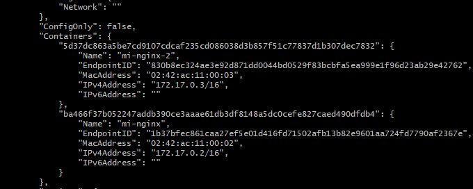

### Comunicación entre la misma red (red default Bridge)

En el caso anterior tenemos 2 containers con red de tipo bridge, mi-nginx y mi-nginx-2, para verificar la comunicación entre ambos ingresaremos a un container y le enviaremos un ping al segundo container. Dentro de nuestro primer container instalaremos la librería para usar ping, hacemos uso de los siguientes comandos:

```
apt-get update
```

Posteriormente

```
apt-get install iputils-ping
```

Y finalmente enviaremos el ping a la IP del segundo container

```
ping 172.17.0.3
```

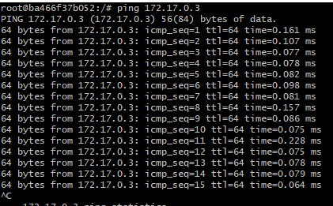

### Comunicación entre diferentes redes pero con mismo driver (controlador) - Fallida

### Creación de una Red

La bandera -d viene a ser el driver o el controlador que se va a utilizar y el nombre de la red.

```
docker network create -d bridge mi-red
```

Posteriormente la listamos para verificar su existencia y su driver asignado

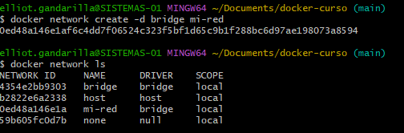

Para asignar la nueva red haremos uso de la bandera --net asignando el nombre de la red creada

```
docker run -d --rm --net=mi-red --name mi-nginx-3 nginx
```

Al inspeccionar la nueva red podemos ver en la llave "Containers" que solo existe mi-nginx-3 y tiene la "misma" IP que un contenedor de diferente red

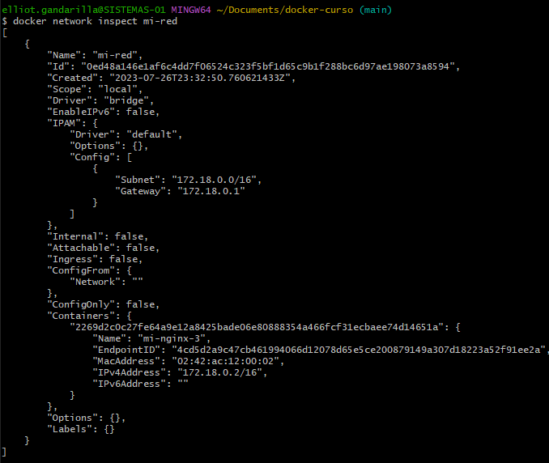

Al intentar enviar un ping desde mi-nginx (con red Bridge) al container mi-nginx-3 (red mi-red) nos podemos dar cuenta de que no se pueden comunicar entre sí, ya que pertenecen a diferentes redes

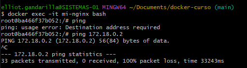

## Comunicación entre diferentes redes pero con mismo driver (controlador) - Completada

Siguiendo los pasos anteriores podemos generar una conexión entre redes usando el comando network especificando que red se comunicará con que container

```
docker network connect bridge mi-nginx-3
```

Al inspeccionar nuestra red bridge nos podremos percatar de que mi-nginx-3 ahora pertenece a nuestra red (mi-red) con su nuevo IP dentro de esa red. Ahora mi-nginx-3 pertenece a amabs redes (bridge y mi-red)

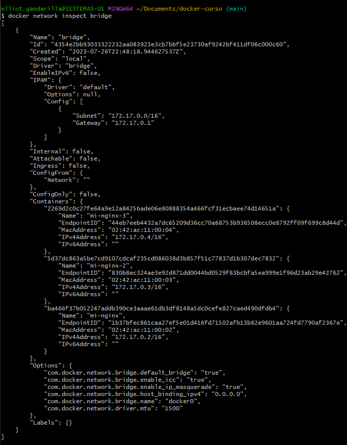

Y ahora sí podremos enviar un ping de nuestro container mi-nginx a nuestro otro container mi-nginx-3

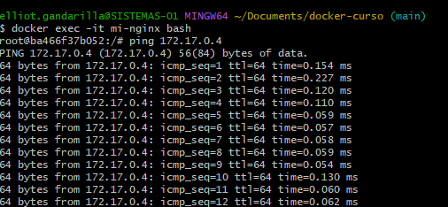

### Recomendaciones:

- Usar Bridge sobre las demás
- A la hora de diseñar una red siempre tener bien mapeado la comunicación entre contenedores

## 3. Imagenes

## 3.1 - Conceptos

### ¿Qué son las imágenes?

Son las bases de los contenedores.

Las imágenes son una colección ordenada de cambios en el sistema de archivos raíz y los parámetros correspondientes de ejecución para su uso en cualquier contenedor.

Las imágenes se construyen con 1 Docker file, un archivo donde se especifica las características de una imagen.

### Capas en las Imágenes

Las imágenes están conformadas por sistemas unidos y apilados uno abajo de otro. Una imagen no tiene estado y nunca cambia.

### Docker Hub

Es un recurso centralizado para usar con Docker y sus componentes. Docker Hub funciona para:

- Alojamiento de Imágenes de Docker.
- Integración con Github y Bitbucket.
- Autenticación de Usuarios.
- Automatizar construcción de imágenes.

## 3.2 - Dockerfile

### ¿Qué es?

Un documento de texto, que contiene los comandos que normalmente se ejecutarían de forma manual para crear una imagen. Docker crea imágenes automáticamente leyendo un Docker File.

### Consejos

- Docker Hub, cuando se necesita información sobre una imagen se puede recurrir a este recurso.
- Editor de Código, cualquiera funciona, en el curso se usa Sublime Text.
- Conexión a Internet, es necesario para descargar imágenes del Docker Hub.
- Paciencia, avanzar a pasos lentos y seguros.

### Construcción de Imágenes

### ¿Cómo se crea un Dockerfile?

Se puede utilizar el comando touch en sistemas operativo Linux y en Windows o Mac, click derecho, crear un archivo de texto. El archivo se debe llamar **Dockerfile**, con **mayúscula**.

### Editando el Dockerfile

- \# : Para crear comentarios, se pueden usar para documentar.
- FROM : Las imágenes de Docker están basadas en otras imágenes, este comando es para especificar en que imagen se basara la nueva imagen .
- RUN: Para ejecutar comandos adentro de las imágenes.
  -y: Una bandera que funciona para contestar a las descargas que necesitan interacción.
- CMD: Para ejecutar comandos, la diferencia entre RUN y CMD es que RUN solo se ejecutara al crear la imagen, en cambio, CMD se ejecutará cuando este corriendo la imagen.
- EXPOSE: Si se montó un servidor web y se quiere exponer la información de este servidor, este comando se puede usar para exponer este servidor en algún puerto.

```
# Esta es mi primera imagen de Docker

FROM Ubuntu

RUN apt-get update
RUN apt-get install python3 python3-dev -y

CMD python3 -m http.server 5000

EXPOSE 5000
```

### Docker build

Comando para construir imágenes de Docker usando un Dockerfile, es una buena practica usar `-t` y así generar un tag, darle nombre y versión a la imagen que se este creando, se debe especificar la ruta donde esta el Dockerfile y todos los archivos que se quieren usar para la imagen

> Si se tiene el Dockerfile y los archivos que se quieren usar en la carpeta que se esta usando, se usa .

```
docker build -t hola-docker:1.0 .
```

Docker leerá el Dockerfile e ira ejecutando las capas-comandos, creando una imagen. Esta imagen ya puede ser usada para crear contenedores.

Tras generar el build podremos verificar la existencia de la imagen

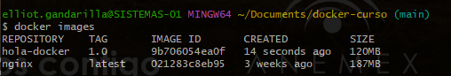

Y posteriormente crear un container a partir de esa imagen

Ejemplo de como crear el container mapeando los puertos para visualizar el contenido del container

```
docker run -d --rm -p5000:5000 --name mi-imagen hola-docker:1.0
```

## 3.3 - Copiar archivos

### Puertos y Localhost

Para ver la información expuesta en el localhost, se va a cualquier navegador y se escribe localhost: + el puerto con la información del contenedor

### Nuevos Comandos

- mkdir: para crear un nuevo directorio.
- WORKDIR: Permite definir un directorio de trabajo, donde se ejecuten los archivos del contenedor y los archivos que se quieran copiar.

```
FROM Ubuntu

RUN apt-get update
RUN apt-get install python3 python3-dev -y
RUN mkdir /app

WORKDIR /app

CMD python3 -m http.server 5000

EXPOSE 5000
```

### Copiar Archivos

Estos 2 comandos funcionan para copiar-mover archivos de nuestra máquina local a un contenedor. También funcionan para copiar carpetas

- ADD: Puede copiar archivos desde la maquina local, un link o archivos en un archivo comprimido
- COPY: Solo permite copiar archivos de la maquina local.

```
ADD index.html /app
ADD index.html .
```

## 3.4 - Variables de entorno

### ¿Qué son?

Son valores que usa el sistema operativo para configurar software y programas. Se utilizan para definir valores que deben estar en el sistema.

### Crear una Variable de Entorno

ENV: Para crear una variable de entorno

```
#Variable de entorno
ENV MSG='Saludos a todos'
```

### Revisar las variables

Se entra al contenedor usando el comando exec y el modo interactivo con -it
Usar comando echo, permite imprimir valores.

```
docker exec -it mi-contenedor
echo $MSG
```

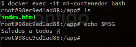

### Cambiar valor

-e: Permite pasarle valores a las variables y cambiarles su valor

```
docker run --rm -d -p 5000:5000 --name mi-contenedor -e MSG='Hola como va' hola-docker:1.3
```

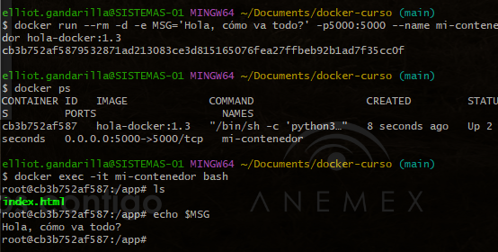

## 3.5 - Dockerignore

### ¿Qué es?

Es un archivo que permite ignorar archivos y así copiar-mover al contenedor solo los necesarios. En su interior se especifican los archivos que el programa va ignorar y así no se suben al contenedor.

### ¿Cómo se crea?

De la misma manera que se crearía un Dockerfile o un .html, con touch en la terminal de Linux o con click derecho > crear archivo de texto en Windows y Mac. El nombre del archivo debe ser **.dockerignore**.

### Utilizar el Dockerignore

Crear una imagen usando Dockerfile que copie archivos (Usando ADD o COPY) y un .dockerignore.

_Ejemplo del contenido de un .dockerignore_


Crear un contenedor basado en la imagen del paso anterior.

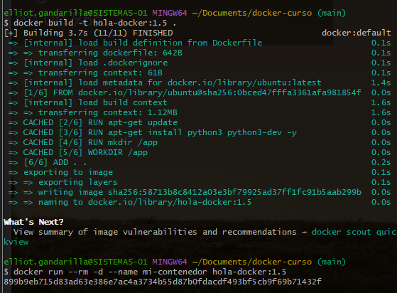

Revisar el contenido del contenedor usando el comando exec.

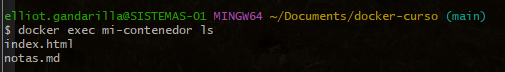

## 3.6 - Publicar imágenes en Docker Hub

> Es un registry donde se pueden subir imagen de Docker.

### ¿Cómo se usa?

- Hay que registrarse, usando un correo electrónico.
- En Respitories se da click al botón "Create Repository" y se le asigna un nombre, se puede configurar para que sea publica y privada, los repositorio privados son paga, con una cuenta gratuita solo se puede tener 1 repositorio privado.

### Subir imágenes a Docker Hub

Para subir imagenes a Docker hub necesitaremos los siguientes comandos:

- docker login: Iniciar sesión desde el navegador, va a pedir nombre de usuario y contraseña.
- docker tag: Puedes poner etiqueta a las imágenes, para el curso, se pone una etiqueta que permite subirlas al Docker Hub.
- docker push: Se especifica la imagen que se quiere subir y al ejecutarlo, se sube la imagen al repository.

```
docker login

docker tag hola-docker:1.0 mauriballesdev/hola-docker-hub:1.0

docker push mauriballesdev/hola-docker-hub:1.0
```

### Opciones de Docker Hub

- Tags: Se pueden ver las versiones de las imágenes que se han subido a la plataforma.
- Builds: Poder sincronizar Github y Bitbucket, permitiendo automatizar la construcción de las imágenes.
- Collaborators: Permitir a otros usuarios colaborar en el desarrollo de imágenes.
- Configuraciones: Poder cambiar el repositorio a privado o eliminarlo.
  Permite poner una descripción corta y/o un readme sobre la imagen (archivo con información sobre la imagen).

## 4 - Docker Compose

## 4.1 - Conceptos

### ¿Qué es?

Es una herramienta para definir y ejecutar aplicaciones Docker de varios contenedores.

Para Compose, se usa un archivo YAML para configurar los servicios de una app. Usando 1 comando, se crea e inicia todo los servicios.

### ¿Cómo funciona

Son 3 procesos:

- Definir el entorno de la aplicación con un Dockerfile.
- Definir los servicios que componen su aplicación en docker-compose.yml para que puedan ejecutarse juntos en un entorno aislado.
- Ejecutar docker-compose up y Compose inicia, ejecutando toda la aplicación.

### Instalación:

Al instalar Docker Desktop se descarga docker-compose.
Usando algún sistema Linux, usando python, específicamente pip, debe agregar sudo si pide algún permiso de sistema.

```
pip install docker-compose

sudo pip install docker-compose
```

## 4.2 - docker-compose.yml

El archivo se debe llamar docker-compose.yml (siempre en minúscula), se crea usando el comando touch en Linux y click derecho, crear archivo de texto en Windows y Mac.

### Editar archivo

> Por estar trabajando en un archivo .yml, se trabaja declarando objetos y asignándoles valores.

- Versión: Se especifica la versión de Docker-compose.
- Services: Los servicios permiten crear y después, conectarlo entre si. Abajo se indica el nombre del servicio y sus especificaciones.
- Build: Crear una imagen y contenedor desde el Docker compose usando un Dockerfile, se debe especificar donde esta el Dockerfile.
- Image: Indicar nombre a la imagen que se construya con build.
- Ports: Permite exponer puertos de un contenedor en la máquina local, hace lo mismo que la bandera -p
- Environment: Para usar variables de entorno.

```
version: "3"

services:
	web:
		build: .
		images: hola-docker-2:1.0
		ports:
			- 5000:5000
		environment:
			MSG: 'Saludo a todos desde compose!'
```

### ¿Cómo usar Docker Compose?

Se simplifica en usar el comando `docker-compose up` para: levantar contenedores, crear una red que conecte el/los servicios, crear una imagen y crea un contenedor-servicio.

```
docker compose up
```

> Igual que docker run, se puede usar la bandera `-d` para correr el proceso en segundo plano.

Si se quiere usar las variables de entorno de un contenedor, se utiliza el comando `exec` y usar `bash`. En docker-compose, existe el comando `run` para ejecutar bash adentro del contenedor.

Este comando necesita dos parametros, el servicio y el comando a ejecutar en el container

```
docker compose run web bash
```

### Detener Servicios

Usando `docker compose down`, revisa los servicios activos, detiene los servicios detectados y elimina los recursos que se habían creado (La red, las imágenes y contenedores).

```
docker compose down
```

> Al usar `docker compose` y un archivo Dockerfile, recomendable usar la bandera `--build`, para que se actualice la imagen automáticamente cada vez que se modifique el Dockerfile.

```
docker compose up -d --build
```

## 4.3 - Servicios

### ¿Qué son los servicios?

Son la manera en la cual Docker-compose puede crear contenedores y comunicarlos entre si.

### Relación entre servicios

- db: Un objeto que existe para crear servicios.
- restart: Cuando el contenedor no funciona como debería, Docker vuelve a levantarlo, básicamente, el programa va a intentar mejorar el rendimiento con un "Apagar y volver a prender".

```
db:
	images: postgres
	restart: always
	environment:
		POSTGRES_PASSWORD: example
```

### Investigar en Docker Hub

> Docker Hub es el lugar donde se recopila información de alguna imagen. Específicamente, la información disponible es: La descripción, las versiones, cómo usar la imagen para un contenedor y cómo utilizar la imagen con docker-compose.

### Intercomunicar Servicios

Los servicios se pueden comunicar entre si siguiendo estos pasos:

- Modificar el Dockerfile: Agregar la directiva `RUN` e instalar `postgresql-client -y`
- Desde la terminal: Usar `docker-compose up` para levantar el contenedor y `docker-compose run web bash` para ingresar al contenedor.
- Activar la conexión: En el primer paso se instalo el comando psql, el cual permite hacer conexiones con una base de datos (PostgreSQL). La bandera `-U` es para especificar el nombre, por defecto es postgres; la bandera `-W` se usa para conectarse a una base de datos, usamos la que esta por defecto, postgres; `-p` funciona para usar algún puerto y `-h` para ingresar a la red de docker-compose.

Dockerfile

```
  RUN apt-get install postgresql-client -y
```

CLI

```
docker-compose up -d --build

docker-compose run web bash
```

```
psql -h db -p 5432 -U postgres -W postgres
```

Así se ingresa a la base de datos, en el host definimos el servicio por su nombre "db", posteriormente su puerto por defecto, usuario por defecto, base de datos y red que esta por defecto.

> Docker crea redes, estas redes crean DNS (Nombre de dominio), a cada le asigna un DNS y así los otros contenedores-servicios que estén adentro del mismo archivo docker-compose conectarse. De esta manera se pueden crear aplicaciones que puedan acceder a servicios que necesitemos e interconectarlos.

## 4.4 - Variables de construcción

### ¿Qué son?

Son variables que hacen lo mismo que una variable de entorno. Estas van en un archivo .env donde se declaran variables de entorno que van a ser valores y configurar un archivo docker-compose.yml.

> El archivo .env SOLO funciona para declarar variables que usara docker-compose.

### ¿Cómo se usan?

- Crear el archivo .env: esto con touch o click derecho > crear archivo de texto, debe compartir carpeta con docker-compose.
- Pasar variables: Solo es escribir adentro del archivo .env las variables de entorno. Para definirlas todas letras del nombre deben estar en mayúscula y si hay varias palabras, excepto de separarlas con espacio, se debe usar guion bajo \_
- Docker-Compose debe usar las variables: Excepto de escribir los valores de los objetos en el mismo docker-compose, escribir el nombre de las variables de construcción encerradas en {} y el signo de dolar \$. `${VAR}`
- Levantar los servicios: Para ello esta `docker-compose up -d --build`
- Revisar configuraciones: Corriendo Bash adentro del contenedor, esto con docker-compose run web bash, lo siguiente es revisar las variables una por una con el comando echo y nombre de la variable.

_Archivo .env_

```
  DB_PASS=hola123
  MSG_CONTENEDOR='Hola variables'
```

_Archivo docker-compose.yml_

```
  DB_PASSWORD: ${DB_PASS}
  MSG: ${MSG_CONTENEDOR}
```

_CLI_

```
docker-compose run web bash

echo $MSG
echo $DB_PASS
```

## 4.5 - Volúmenes

### Manejo de volúmenes

> Se sigue editando un Dockefile

Los volúmenes se manejan de 3 formas:

- Almacenándola en la memoria, si la vida útil del contenedor se termina, también la información adentro de este se acaba, se elimina.
- Conectar con una ruta de archivos, que la información de esa carpeta se vea reflejada en el contenedor.
- Crear un Volumen, así Docker se encarga de el, aunque el contenedor muera, la información seguirá ahí, en nuestra maquina local.

### Crear Volúmenes con Docker Compose

Volúmenes: Un objeto el cual se le especifica 2 cosas: La ruta en la maquina local y la ruta en el contenedor. Con solo un . el programa entiende que TODO lo que este en la carpeta donde se esta trabajando, lo tiene que copiar (No copia lo que indique el Dockerignore)

```
volumes:
	- .:/app
```

### Otra manera

Creando un volumen que se guarde, sin importar el contenedor que lo use.

- data: Es el nombre del volumen, en este caso se llama data, sin embargo, se puede llamar de cualquier manera, lo importante es que tenga un nombre
- driver: Es el driver que se usa por defecto, en este caso se usa el que esta por defecto, local

```
volumes:
	data:
		driver: local
```

### Revisar Bases de Datos

Ingresar adentro del contenedor usando docker run web bash
Conectarse al servidor de la base de datos, para ello se utiliza la "cadena de conexión" que seria psql.
Ya con acceso a la base de datos, utilizando `\l` se visualizan las bases de datos disponibles (las 3 se crean por defecto) y con `CREATE DATABASE `crear una nueva base de datos

```
docker run web bash
```

```
psql -h db -p 5432 -U postgres -W postgres
```

```
\l

CREATE DATABASE hola WITH OWNER postgres
```

Si se detiene el servicio que contiene la base de datos recién creada y se vuelve a levantar, se elimina esa base de datos por no tener un volumen que guardara los cambios que se habían hecho.

### Buscar una Solución

La solución a este problema y muchos otros problemas debería estar en Docker Hub, en la descripción profunda de la imagen postgres se puede ver el directorio donde se guarda la data y esa ruta es usada para crear un volumen.

```
db:
image: postgres
restart: always
environment:
POSTGRES_PASSWORD: ${DB_PASS}
volumes: - /var/lib/postgresql/data

volumes:
data:
driver: local
```

Ahora ya esta guarda la información de la base de datos en un volumen, después de indicarle al programa cual era la ruta donde estaba la información, la cuál se almacena aparte, creando un respaldo.

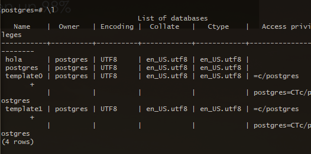
